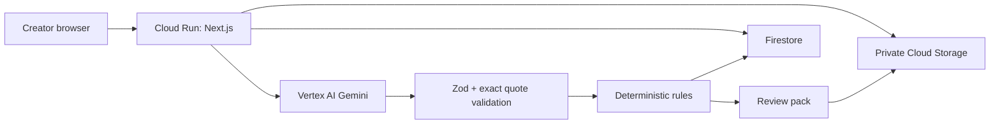

# Google Cloud and Gemini architecture

Reviewed 2026-07-22 against [Google Gen AI JS SDK](https://googleapis.github.io/js-genai/), [Gemini structured output](https://ai.google.dev/gemini-api/docs/structured-output), [Gemini model catalog](https://ai.google.dev/gemini-api/docs/models), [Gemini pricing](https://ai.google.dev/gemini-api/docs/pricing), and [Cloud Run Node deployment](https://cloud.google.com/run/docs/quickstarts/build-and-deploy/deploy-nodejs-service).

## Selected services

- **Cloud Run**: public Next.js application, API, agent endpoint, health and readiness. One service first.
- **Firestore**: users, projects, claims, confirmation hashes, agent runs, pilot applications, and business snapshots.
- **Cloud Storage**: private original sources and generated packs; random object paths, short-lived signed URLs, lifecycle deletion.
- **Vertex AI Gemini**: production structured extraction and follow-up drafting through `@google/genai`.
- **Secret Manager**: optional developer-API/payment/auth secrets; Vertex production should prefer service-account identity.
- **Cloud Logging**: redacted run metadata only; no original source text, secrets, contact details, or chain-of-thought.

## Gemini implementation

The current official unified JavaScript SDK is `@google/genai`. The adapter supports Vertex AI (`vertexai: true`, project, location) and the Gemini Developer API (server-side API key). Production requires an explicit `GEMINI_MODEL`; no unverified model is silently selected. As of the verification date, official docs list stable Gemini model families including Gemini 2.5 Flash and newer stable Gemini 3-series models. The deployer must choose a currently supported structured-output model after a final official-doc recheck.

The prompt separates system policy, user request, and `<UNTRUSTED_SOURCE_CONTENT>`. Output uses a JSON Schema derived from Zod. Every returned claim is parsed again and rejected unless `sourceQuote` is an exact substring of its referenced fragment. Split math, conflict rules, readiness, expiry, and business totals never come from the model.

## Data flow

## IAM target

Runtime service account: Cloud Run invoker runtime, Vertex AI User, Datastore User, Storage Object User on one bucket, Secret Manager Secret Accessor only for named secrets, Logs Writer. Do not grant Owner/Editor. Human deployer roles remain separate.

## Cost controls

Per-run file/fragment/contributor/call caps, 30-second model timeout, at most two retries, low temperature, explicit model, Cloud Run max instances, storage lifecycle, project budget alerts, and recorded token/cost metadata. Pricing changes; verify immediately before production.

## Evidence required before marking complete

1. Deployed URL and revision digest.
2. Redacted Cloud Run health and readiness responses.
3. Real structured Gemini call with model, timestamp, request ID/usage, schema-valid output, and exact-quote validation.
4. Firestore write/read, private Storage upload/signed-read/delete, Secret Manager access, and production deletion tests.
5. IAM and billing-budget screenshots without secrets or customer data.

None of these live checks is currently claimed.
