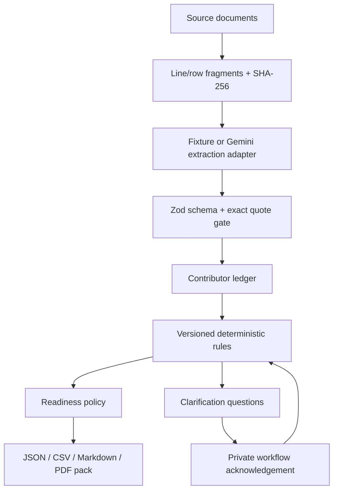

# Architecture

The application is one strict-TypeScript Next.js service. Core modules are pure and deterministic; provider adapters are server-only.

Server-only boundaries contain secrets, provider clients, rate limits, storage, database, and business intake. Browser code receives only the minimum rendered result. Fixture data never enters production business totals.
